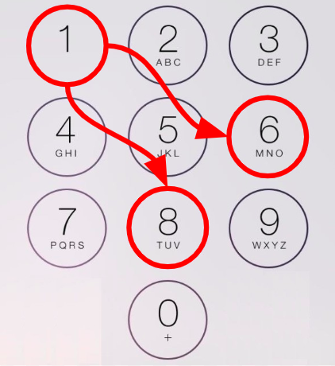

# Knight's Dialer

[Link to source](https://medium.com/hackernoon/google-interview-questions-deconstructed-the-knights-dialer-f780d516f029)

[Link to follow-up](https://medium.com/@alexgolec/google-interview-questions-deconstructed-the-knights-dialer-impossibly-fast-edition-c288da1685b8)

## Question

Suppose you dial keys on the keypad using only hops a knight can make. Every time the knight lands on a key, we dial that key and make another hop. The starting position counts as being dialed.

How many distinct numbers can you dial in N hops from a particular starting position?



## Solution

_See the source article for detailed explanation_

## Usage

```txt
$ python main.py -h
usage: main.py [-h] hops

positional arguments:
  hops        Number of hops to make (0-15)

optional arguments:
  -h, --help  show this help message and exit
```

## Example

```txt
$ python main.py 2
=======================[ 0 ]===================================
  count_sequences(0, 2) =    6 (  9 function calls)
 count_with_cache(0, 2) =    6 (  9 function calls)
    count_with_dp(0, 2) =    6 (  2 iterations)
count_with_matrix(0, 2) =    6 (  2 iterations)
=======================[ 1 ]===================================
  count_sequences(1, 2) =    5 ( 17 function calls)
 count_with_cache(1, 2) =    5 ( 17 function calls)
    count_with_dp(1, 2) =    5 (  4 iterations)
count_with_matrix(1, 2) =    5 (  4 iterations)
=======================[ 2 ]===================================
  count_sequences(2, 2) =    4 ( 24 function calls)
 count_with_cache(2, 2) =    4 ( 24 function calls)
    count_with_dp(2, 2) =    4 (  6 iterations)
count_with_matrix(2, 2) =    4 (  6 iterations)
=======================[ 3 ]===================================
  count_sequences(3, 2) =    5 ( 32 function calls)
 count_with_cache(3, 2) =    5 ( 32 function calls)
    count_with_dp(3, 2) =    5 (  8 iterations)
count_with_matrix(3, 2) =    4 (  8 iterations)
=======================[ 4 ]===================================
  count_sequences(4, 2) =    6 ( 42 function calls)
 count_with_cache(4, 2) =    6 ( 42 function calls)
    count_with_dp(4, 2) =    6 ( 10 iterations)
count_with_matrix(4, 2) =    6 ( 10 iterations)
=======================[ 5 ]===================================
  count_sequences(5, 2) =    0 ( 43 function calls)
 count_with_cache(5, 2) =    0 ( 43 function calls)
    count_with_dp(5, 2) =    0 ( 12 iterations)
count_with_matrix(5, 2) =    0 ( 12 iterations)
=======================[ 6 ]===================================
  count_sequences(6, 2) =    6 ( 53 function calls)
 count_with_cache(6, 2) =    6 ( 53 function calls)
    count_with_dp(6, 2) =    6 ( 14 iterations)
count_with_matrix(6, 2) =    6 ( 14 iterations)
=======================[ 7 ]===================================
  count_sequences(7, 2) =    5 ( 61 function calls)
 count_with_cache(7, 2) =    5 ( 61 function calls)
    count_with_dp(7, 2) =    5 ( 16 iterations)
count_with_matrix(7, 2) =    5 ( 16 iterations)
=======================[ 8 ]===================================
  count_sequences(8, 2) =    4 ( 68 function calls)
 count_with_cache(8, 2) =    4 ( 68 function calls)
    count_with_dp(8, 2) =    4 ( 18 iterations)
count_with_matrix(8, 2) =    4 ( 18 iterations)
=======================[ 9 ]===================================
  count_sequences(9, 2) =    5 ( 76 function calls)
 count_with_cache(9, 2) =    5 ( 76 function calls)
    count_with_dp(9, 2) =    5 ( 20 iterations)
count_with_matrix(9, 2) =    5 ( 20 iterations)
```
